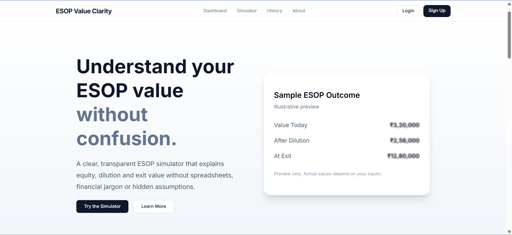
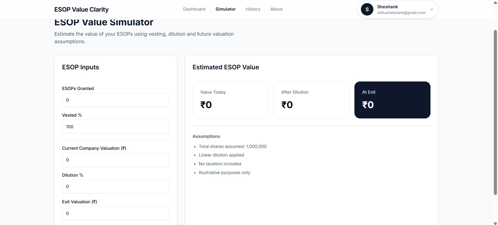
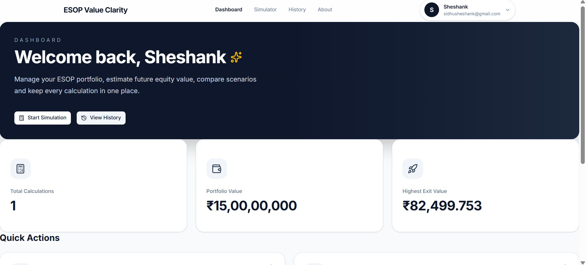
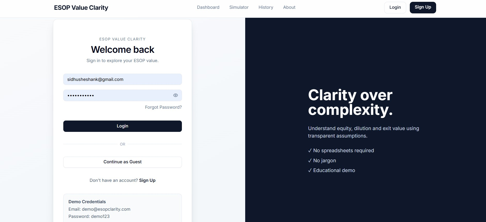
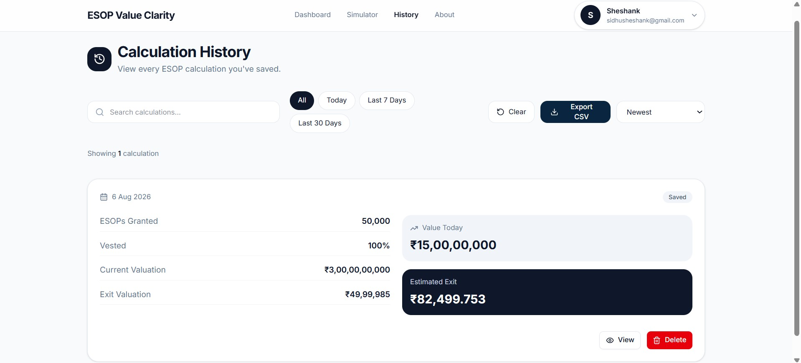

<div align="center">

# ESOP Value Clarity

### Understand what your startup equity is actually worth.

Most employees receive ESOPs.

Very few understand them.

ESOP Value Clarity transforms complex equity calculations into an experience anyone can understand.

No spreadsheets.

No finance background.

Just clarity.

<br>

🌐 **Live Demo**

https://esop-value-clarity.vercel.app/

---



</div>

---

# Why I Built This

During conversations with students, startup employees and early professionals, I noticed the same pattern.

People proudly mentioned receiving ESOPs.

Very few could answer simple questions like:

- What are my ESOPs worth today?
- How does dilution affect my ownership?
- What happens after another funding round?
- What could my equity become if the company grows?
- What does vesting actually mean?

Most available calculators were either hidden behind spreadsheets, filled with financial jargon or built for investors instead of employees.

I wanted something different.

A product that explains equity instead of intimidating people.

That became **ESOP Value Clarity**.

---

# The Problem

Employee Stock Ownership Plans are becoming a standard part of startup compensation.

Understanding them is not.

Employees often receive thousands of options without knowing:

- how ownership changes over time
- how dilution affects value
- what vesting really means
- what an exit scenario could look like

Financial knowledge shouldn't be a requirement for understanding your own compensation.

---

# The Solution

ESOP Value Clarity provides an interactive environment where employees can experiment with different equity scenarios and instantly understand the financial impact.

Instead of guessing...

Users can explore.

Instead of reading definitions...

Users can simulate outcomes.

The goal isn't predicting the future.

The goal is understanding it better.

---

# Product Preview

## Simulator



Experiment with:

- ESOP grants
- Vesting percentages
- Company valuation
- Dilution
- Future exit value

---

## Dashboard



Registered users can:

- Save calculations
- Track previous simulations
- View dashboard insights
- Build an equity history

---

## Login Experience



A simple authentication flow with demo credentials for exploration.

---

## History



Every calculation becomes part of your learning journey.

Users can revisit previous simulations instead of starting from scratch.

---

# Features

- Interactive ESOP simulator
- Vesting calculations
- Dilution modelling
- Exit value estimation
- Historical simulation tracking
- Secure authentication
- Responsive interface
- Guest mode
- Educational assumptions
- Mobile friendly

---

# Demo Account

Use the demo account to explore every feature.

Email

```
demo@esopclarity.com
```

Password

```
demo@123
```

Guest users can also try the simulator without creating an account.

---

# Technology Stack

## Frontend

- Next.js
- React
- TypeScript
- Tailwind CSS
- shadcn/ui

## Backend

- Next.js API Routes
- JWT Authentication

## Database

- MySQL

## Deployment

- Vercel

---

# Project Structure

```
app/
components/
lib/
public/
assets/
README.md
```

---

# Design Philosophy

Every design decision follows one principle.

**Complex financial concepts should become easier through software—not harder.**

The application focuses on:

- clarity over complexity
- education over speculation
- transparency over hidden calculations
- thoughtful UX over unnecessary features

---

# Future Roadmap

- Company cap table simulation
- Multiple funding rounds
- ESOP tax estimation
- Startup benchmark comparisons
- Portfolio tracking
- AI-assisted equity explanations
- Scenario sharing
- PDF reports

---

# Lessons Learned

Building ESOP Value Clarity wasn't just about writing code.

It required understanding:

- financial modelling
- product thinking
- user education
- authentication
- backend architecture
- state management
- responsive design
- simplifying difficult concepts

The hardest challenge wasn't building the calculator.

It was making complex ideas feel simple.

---

# Local Setup

Clone the repository

```bash
git clone https://github.com/sidhushesank/esop-value-clarity.git
```

Install dependencies

```bash
npm install
```

Run locally

```bash
npm run dev
```

---

# Feedback

If you're a startup founder, HR professional, investor or employee receiving ESOPs,

I'd genuinely love to know:

**What would make understanding equity easier for you?**

Issues and suggestions are always welcome.

---

<div align="center">

## Build software that teaches.

Not just software that calculates.

---

Made with ❤️ by **Sheshank Sidheshwar**

</div>
